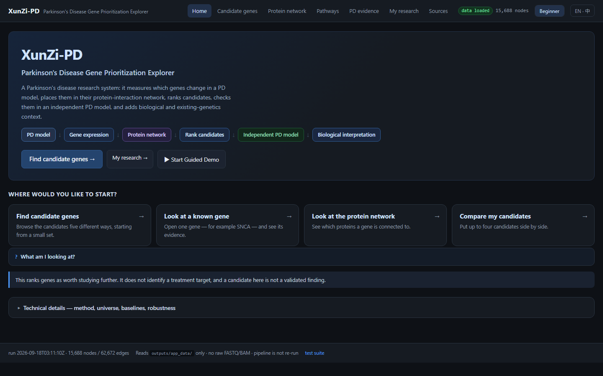
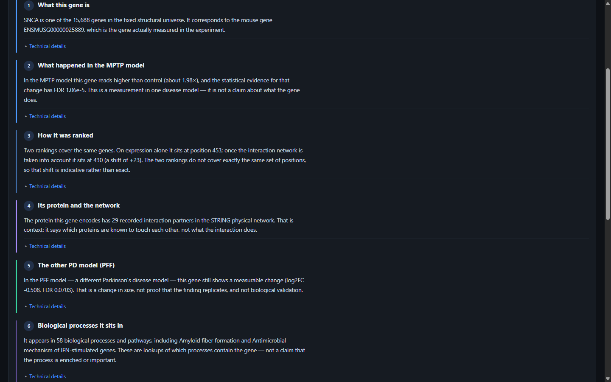
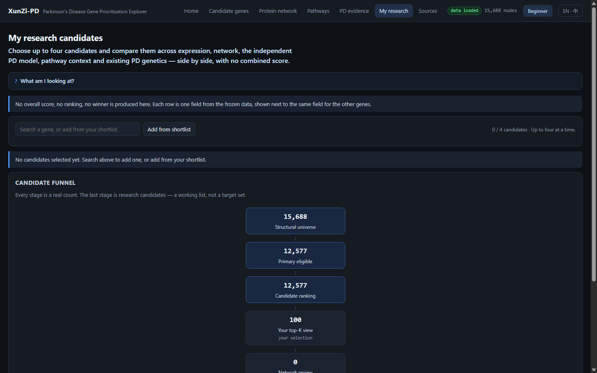

# XunZi-PD

**A plain-language explorer for a completed Parkinson's disease gene-prioritisation study.**

[Open the public app](https://pc-wang-ai.github.io/XunZi-PD-Reproduction/16_app/) · [Sources and provenance](https://pc-wang-ai.github.io/XunZi-PD-Reproduction/16_app/#provenance)

XunZi-PD helps a reader follow a research candidate from one question to the next: what changed in the MPTP model, how it was ranked, whether its protein has network context, what the PFF model shows, which pathways mention it, and whether the loaded PD genetics reference mentions it.

It is designed to be understandable without prior knowledge of DESeq2, RWR, or STRING. The app opens in **Beginner** mode; **Expert** mode reveals the same underlying scientific fields in full. A Chinese/English interface switch is available in the app.

> **Research use only.** XunZi-PD is not a diagnostic system, a treatment recommendation, evidence of disease causality, or a validated therapeutic-target list.

## Start in three steps

1. **Find a candidate** — browse a guided candidate view or search for a known gene.
2. **Read the evidence** — use the quick evidence guide to answer the key questions in everyday language, then open the original evidence section when more detail is needed.
3. **Keep a small research list** — add up to four candidates to *My research*, compare their existing fields, complete any unread evidence steps, and export a rule-generated summary.

## What the app makes easier

| You want to know | Where to look |
| --- | --- |
| Why is this gene on the candidate list? | Candidate card and single-gene evidence guide |
| What happened in the MPTP model? | Single-gene evidence: MPTP section |
| Does the protein have recorded network context? | Protein network |
| What does the independent PFF model show? | Single-gene evidence: PFF section |
| Which pathways or processes mention it? | Pathways |
| Does the loaded PD genetics reference mention it? | PD evidence |
| What has not been checked yet? | My research — clickable reading checklist |

## My research stays in your browser

The workspace is for organising your own reading, not generating a new score or a winner. It can hold up to four candidates and offers a copyable sharing link plus TXT, CSV, and Markdown exports.

- Shortlists, notes, and reading progress are stored only in the visitor's browser.
- Notes are not uploaded, shared through the link, or used in any calculation.
- The app is static: it has no login, no server-side workspace, no model retraining, and no analysis rerun.

## Scientific boundary and data integrity

The public site is a read-only presentation of a completed, frozen analysis. It does not add scores, thresholds, rankings, algorithms, or scientific results.

- STAT-DE-v1 and STRING-RWR-v1 ranks are displayed as reported, never recomputed or re-ranked.
- Pathway and PD evidence are context layers; they do not feed into candidate ranking.
- A measurable change in the PFF model is not called replication, biological validation, or a therapeutic target.
- Absence in a loaded reference is reported as absence of evidence, not novelty.

## Copyright, attribution, and responsible reuse

The interface and project-specific presentation are published for public research demonstration. **No open-source license is granted unless a license file is explicitly added.**

Scientific identifiers, database records, pathway names, and derived evidence remain subject to the rights, citation requirements, and terms of their original providers. Before redistributing or using scientific content commercially, review the provider's current terms and cite the relevant databases and underlying studies.

See [THIRD_PARTY_NOTICES.md](THIRD_PARTY_NOTICES.md) for the resources represented here, including STRING, Ensembl, Reactome, Gene Ontology, and the NHGRI-EBI GWAS Catalog. Source providers do not endorse XunZi-PD or its interpretations.

## What is published here

This repository contains only the static app and the minimum frozen, derived data required for the public demonstration. It intentionally excludes raw FASTQ/BAM files, private analysis workspaces, source reference downloads, and development reports.

## For an AI application portfolio

XunZi-PD demonstrates an AI-product design principle: make complex evidence navigable without concealing scientific uncertainty. The interface translates a fixed analysis into a guided, bilingual workflow while preserving source boundaries, technical detail for experts, local-only personal state, and explicit non-clinical safeguards.

The optional AI evidence Q&A appears on a single-gene page only when its separately deployed backend is ready. It accepts only a short research question, selected public gene ID, and interface language; it retrieves a pinned evidence snapshot itself, returns backend-generated citations, and refuses medical or out-of-scope requests. The model key remains server-side and the feature fails closed when its runtime configuration is incomplete. Its privacy rules, citations, refusals, and deployment gate are documented in [AI_QA_SECURITY_DESIGN.md](docs/AI_QA_SECURITY_DESIGN.md).

### Public AI evidence Q&A

[Try it on a single-gene page](https://pc-wang-ai.github.io/XunZi-PD-Reproduction/16_app/#gene/0). The guided Q&A provides three one-click research questions for every gene, then separates the returned explanation into four readable parts: the evidence-based answer, field-level citations, current evidence gaps, and the scientific boundary. Visitors may optionally rate an answer as Helpful or Not helpful; that event contains only the boolean choice, never the question, gene ID, notes, or personal information.

The Worker uses a server-side DeepSeek key, an immutable source snapshot verified by SHA-256, explicit browser-origin rules, per-IP rate limiting, and medical / prompt-injection refusals. It has no web search, file access, or clinical-decision capability. See the [security design](docs/AI_QA_SECURITY_DESIGN.md) and [public privacy notice](16_app/privacy.html).
